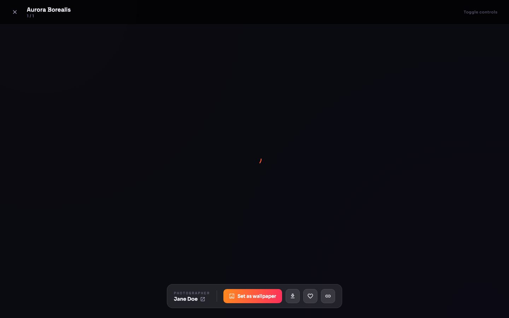
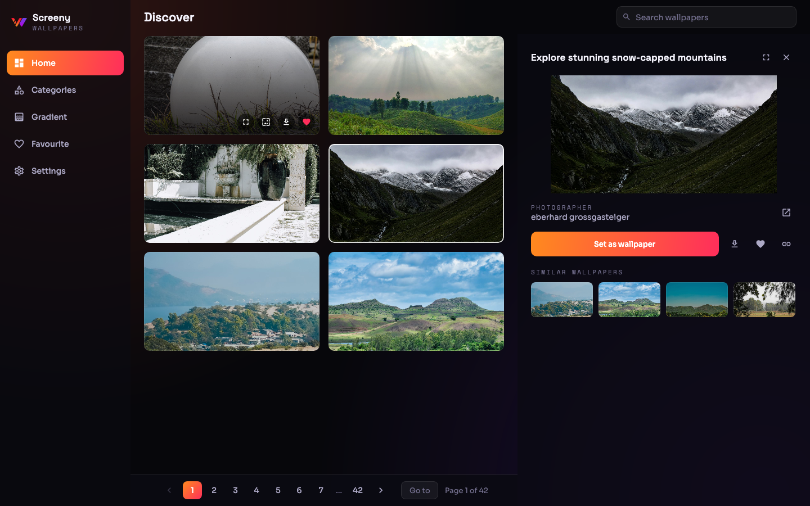
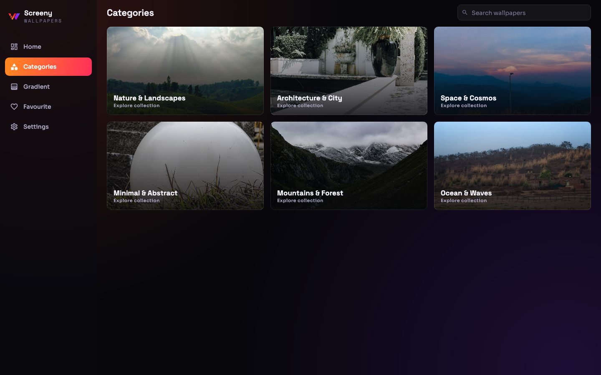
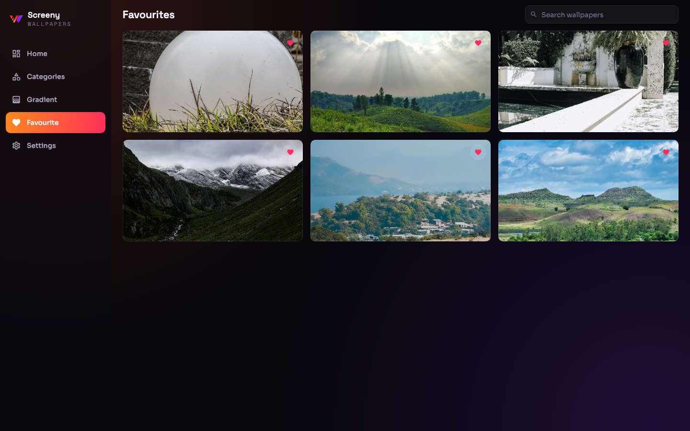
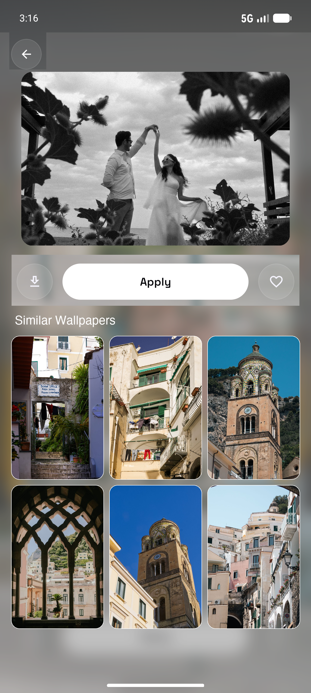

# Screeny — Compose Multiplatform Wallpaper App

<p align="center">
  
</p>

<p align="center">
  <b>A modern, dark-first wallpaper client crafted with Compose Multiplatform for Android, iOS, macOS, Windows, and Linux.</b>
</p>

<p align="center">
  <a href="https://kotlinlang.org"></a>
  <a href="https://www.jetbrains.com/lp/compose-multiplatform/"></a>
  
  <a href="LICENSE"></a>
</p>

<p align="center">
  <a href="#-desktop-showcase">Desktop Showcase</a> •
  <a href="#-mobile-showcase">Mobile Showcase</a> •
  <a href="#-key-features">Features</a> •
  <a href="#-tech-stack--architecture">Tech Stack</a> •
  <a href="#-getting-started">Getting Started</a> •
  <a href="#-keyboard-shortcuts">Shortcuts</a>
</p>

---

## 🖥️ Desktop Showcase

Screeny features a desktop experience built to macOS, Windows, and Linux conventions with a persistent sidebar, instant search, numbered pagination, and high-resolution preview modes.

### 🔍 Immersive Full-Screen Lightbox Preview
Preview original high-resolution photography with a toggleable glassmorphic HUD, photographer metadata, direct profile links, and keyboard navigation.



---

### 🗂️ Browse Feed with Numbered Pagination & Detail Pane
Browse 16:9 wallpapers with quick-action hover buttons, contextual master-detail pane, and jump-to-page navigation.



---

### 📂 Curated Categories & Offline Favourites
Organize wallpapers into categories or save high-resolution favorites offline powered by multiplatform Room SQLite.

| Curated Categories | Offline Favourites |
| :---: | :---: |
|  |  |

---

## 📱 Mobile Showcase

Screeny delivers fluid edge-to-edge gesture navigation, infinite scrolling feeds, and shared element transitions on Android and iOS.

| Curated Feed | Wallpaper Detail | Similar Wallpapers |
| :---: | :---: | :---: |
|  |  |  | 

---

## ✨ Key Features

- 🖥️ **Tailored Desktop Experience (macOS, Windows, Linux)**:
  - Fixed glassmorphic sidebar with Screeny signature branding.
  - Persistent instant-search toolbar (<kbd>⌘</kbd> / <kbd>Ctrl</kbd> + <kbd>F</kbd>).
  - Numbered page navigation (40 items/page) with direct jump-to-page dialog.
  - Quick-action card hover overlays and right-click context menus.
  - Native window size and position persistence.
  - Native OS wallpaper setting (`osascript` on macOS, PowerShell on Windows, `gsettings` on Linux).
- 🔍 **Full-Screen Lightbox Viewer**:
  - Displays original high-resolution imagery.
  - Click anywhere or press <kbd>Space</kbd> to toggle the floating glass HUD.
  - Photographer credit, resolution info, and quick profile navigation.
  - Seamless in-viewer feed browsing with <kbd>←</kbd> / <kbd>→</kbd> arrow keys.
- 📱 **Mobile UI (Android & iOS)**:
  - Infinite scroll feed powered by Paging 3 Multiplatform.
  - Gesture-driven bottom sheets, shared element transitions, and parallax scrolling.
- 🎨 **Mesh Gradient Generator**:
  - Interactive multi-point aurora gradient presets with instant wallpaper application and PNG export.
- 💾 **Local Persistence**:
  - Offline favourites, user preferences, and search history powered by Room (KMP SQLite).
- 🌐 **Internationalization**:
  - Multi-language support with runtime locale switching across 20+ languages.
- 🔒 **Zero-Leak Secret Architecture**:
  - Dynamic build-time config via `local.properties` or environment variables without committing secrets to git.

---

## 🛠️ Tech Stack & Architecture

```
┌─────────────────────────────────────────────────────────────┐
│                       Compose Multiplatform UI              │
│   ┌───────────────────────────┐ ┌───────────────────────┐   │
│   │   Mobile UI (Navigation3) │ │ Dedicated Desktop UI  │   │
│   └─────────────┬─────────────┘ └───────────┬───────────┘   │
└─────────────────┼───────────────────────────┼───────────────┘
                  ▼                           ▼
┌─────────────────────────────────────────────────────────────┐
│                 Shared ViewModels & Domain Models           │
├─────────────────────────────────────────────────────────────┤
│         Koin DI (Annotations)  •  Mappers & UseCases       │
├─────────────────────────────────────────────────────────────┤
│   Ktor Client (OkHttp / Darwin) │   Room Database (KMP SQLite)│
└─────────────────────────────────────────────────────────────┘
```

| Layer | Library / Technology |
| :--- | :--- |
| **UI Framework** | [Compose Multiplatform](https://www.jetbrains.com/lp/compose-multiplatform/) (Kotlin 2.4 / AGP 9.1) |
| **Dependency Injection** | [Koin](https://insert-koin.io/) + Koin Annotations (KSP) |
| **Networking** | [Ktor](https://ktor.io/) 3.5 (OkHttp on Android & Desktop, Darwin on iOS) |
| **Local Database** | [Room KMP](https://developer.android.com/kotlin/multiplatform/room) 2.8 + SQLite |
| **Paging** | [CashApp Multiplatform Paging 3](https://github.com/cashapp/multiplatform-paging) |
| **Image Loading** | [Landscapist](https://github.com/skydoves/landscapist) + [Coil 3](https://coil-kt.github.io/coil/) |
| **Design System** | Glassmorphism (`Ink950` dark space palette, Aurora gradients, frosted scrims) |

---

## 🚀 Getting Started

### 1. Clone the repository
```bash
git clone https://github.com/Shahidzbi4213/WallpaperApp-Cmp.git
cd WallpaperApp-Cmp
```

### 2. Configure your Pexels API Key
Get a free API key at [pexels.com/api](https://www.pexels.com/api/). Copy [`local.properties.example`](./local.properties.example) to `local.properties` and paste your key:

```properties
PEXELS_API_KEY=your_pexels_api_key_here
```
*(You can also set `PEXELS_API_KEY` as an environment variable).*

---

### 3. Build & Run

#### 🖥️ Desktop (macOS, Windows, Linux)
```bash
# Run the application
./gradlew :desktopApp:run

# Package native installers
./gradlew :desktopApp:packageDmg   # macOS (.dmg)
./gradlew :desktopApp:packageMsi   # Windows (.msi)
./gradlew :desktopApp:packageDeb   # Linux (.deb)
```

#### 🤖 Android
```bash
./gradlew :androidApp:assembleDebug
```

#### 🍎 iOS
Open `iosApp/iosApp.xcodeproj` in Xcode and press **Run**, or run via Fleet / Android Studio.

---

## ⌨️ Desktop Keyboard Shortcuts

| Shortcut | Action |
| :--- | :--- |
| <kbd>⌘</kbd> / <kbd>Ctrl</kbd> + <kbd>F</kbd> | Focus search bar |
| <kbd>⌘</kbd> / <kbd>Ctrl</kbd> + <kbd>,</kbd> | Open Settings |
| <kbd>Esc</kbd> | Close preview / full-screen viewer / navigate back |
| <kbd>Space</kbd> | Toggle HUD controls in full-screen lightbox |
| <kbd>←</kbd> / <kbd>→</kbd> | Browse previous / next wallpaper in full-screen |
| <kbd>F</kbd> | Toggle favourite status |

---

## 🧪 Testing

```bash
# Run multiplatform shared unit tests
./gradlew :composeApp:allTests

# Run Desktop UI smoke tests & headless preview renders
./gradlew :composeApp:desktopTest
```

---

## 💖 Star the Repo

If you enjoy Screeny or find this Compose Multiplatform reference helpful, please give it a **⭐ on GitHub**!

---

<div align="center">
  <sub>Built with ❤️ using Kotlin & Compose Multiplatform.</sub>
</div>
